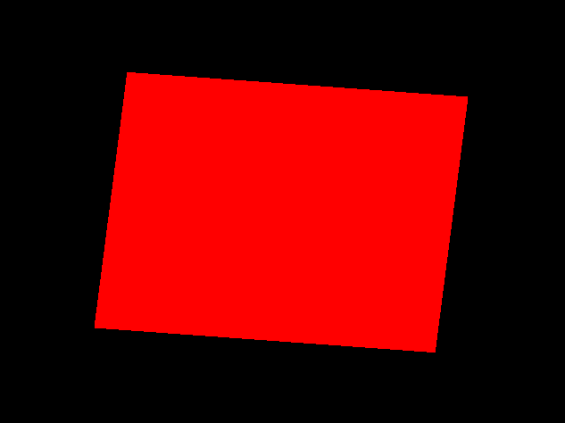
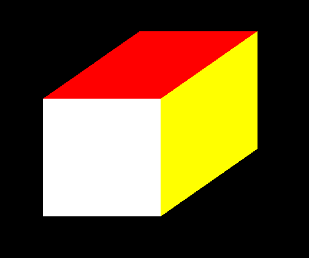
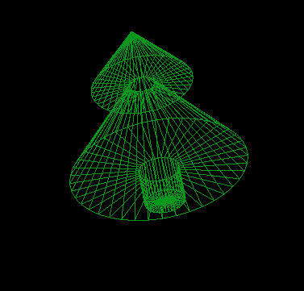
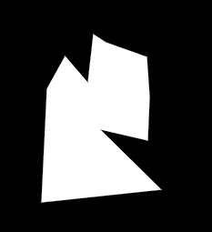
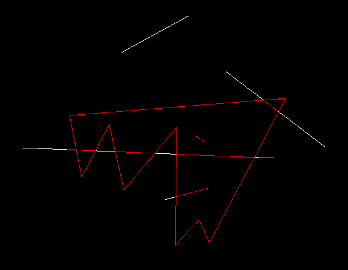
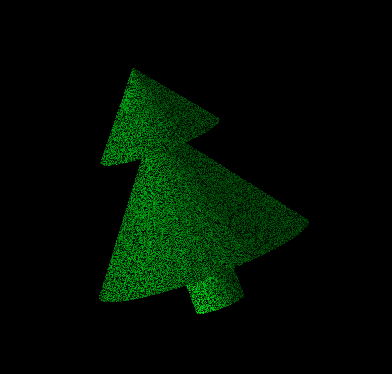

# OpenGL samples

## Requirements
- python3
- PyOpenGL
- glfw
- numpy
- PIL

## Launch
Run main.py file from any directory with python3 interpreter.
Usage manuals placed in each folder.

## Programs
### Sample
Elementary program that demonstrates OpenGL initialization and simple animation. 



### Volumetric Figures
Draw cube and arbitrary surface of rotation. Program can apply horizontal isometric projection.




### Rasterization
Drawing arbitrary polygon using ```glDrawPixels``` and smoothing with Bresenham's line algorithm.



### Clipping
Сutting off parts of the segments that are located outside the polygon. Use parametrical algorithm with sorting intersection points.



### Realistic
Adding lightning and textures to **Volumetric Figures**. Can show tweening animation.



### Shaders
Realiztion of **Volumetric Figures** with OpenGL shaders.
